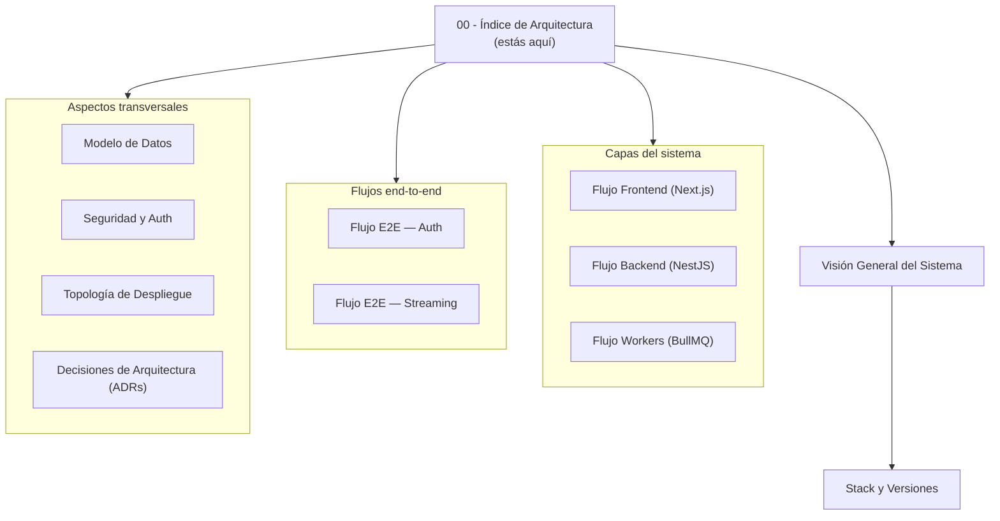

# 🏗 GlobeLiv — Arquitectura Técnica

> **Cómo funciona el sistema hoy.** Referencia atemporal — se actualiza cuando algo cambia, no crece con cada sprint.
>
> Si buscas "qué se construyó cuándo" → [[00 - Índice de Progreso]].

---

## 🗺 Mapa de la sección

---

## 🚀 Si es tu primera vez

Léelo en este orden:

1. **[[Visión General del Sistema]]** — el diagrama maestro de 3 capas (Vercel · Railway · servicios externos).
2. **[[Stack y Versiones]]** — qué hay instalado y por qué.
3. **[[Topología de Despliegue]]** — dónde corre cada cosa en producción.
4. **[[Flujo End-to-End — Auth]]** — el primer flujo completo que vas a tocar.
5. **[[Flujo End-to-End — Streaming]]** — el core del producto.

Después, lee según necesidad:
- ¿Trabajando en `apps/web`? → [[Flujo Frontend (Next.js)]]
- ¿Trabajando en `apps/api`? → [[Flujo Backend (NestJS)]]
- ¿Trabajando con datos? → [[Modelo de Datos]]
- ¿Algo de auth/cookies/CORS? → [[Seguridad y Auth]]
- ¿Una decisión grande? → [[Decisiones de Arquitectura (ADRs)]]

---

## 📚 Catálogo completo

### Visión panorámica
- [[Visión General del Sistema]] — diagrama de 3 capas + responsabilidades
- [[Stack y Versiones]] — snapshot de runtime, libs y servicios

### Capas
- [[Flujo Frontend (Next.js)]] — App Router, providers, tRPC client, design tokens
- [[Flujo Backend (NestJS)]] — bootstrap, tRPC, Drizzle, módulos Nest
- [[Flujo Workers (BullMQ)]] — cola, jobs, idempotencia

### Flujos end-to-end
- [[Flujo End-to-End — Auth]] — signup/signin/OAuth/logout con secuencias
- [[Flujo End-to-End — Streaming]] — Go Live, Watch, Agora tokens

### Transversales
- [[Modelo de Datos]] — schema de `users`, `streams`; índices y reglas
- [[Seguridad y Auth]] — JWT, bcrypt, CORS, cookies cross-domain, OAuth
- [[Topología de Despliegue]] — Vercel + Railway + DNS + Postgres + Redis
- [[Decisiones de Arquitectura (ADRs)]] — las "no se discuten"

---

## 🔗 Cómo se conecta esta sección con el resto del vault

- [[00 - Índice]] — el índice maestro del vault (producto)
- [[00 - Índice de Progreso]] — la bitácora cronológica
- [[Reglas de UX que no se negocian]] — reglas de producto que esta arq enforcea
- [[Sistema de Misiones]], [[Sistema de Propinas]], etc. — sistemas de producto que llegan en sprints futuros

> Cada vez que un componente arquitectónico cambie (ej. migrar avatares de data URL a R2), **actualiza la nota correspondiente** + deja un breve registro en la bitácora del sprint.

---

## ⚙️ Cómo está hecho

- **Diagramas:** Mermaid (Obsidian los renderiza nativo, no necesita plugin)
- **Convención de nombres:** sustantivos descriptivos sin numeración interna
- **Wikilinks** entre notas — usa `Cmd+G` (Graph view) para ver el grafo de conexiones
- **Cada nota empieza con** YAML frontmatter (`sección`, `tema`) para filtrar después
