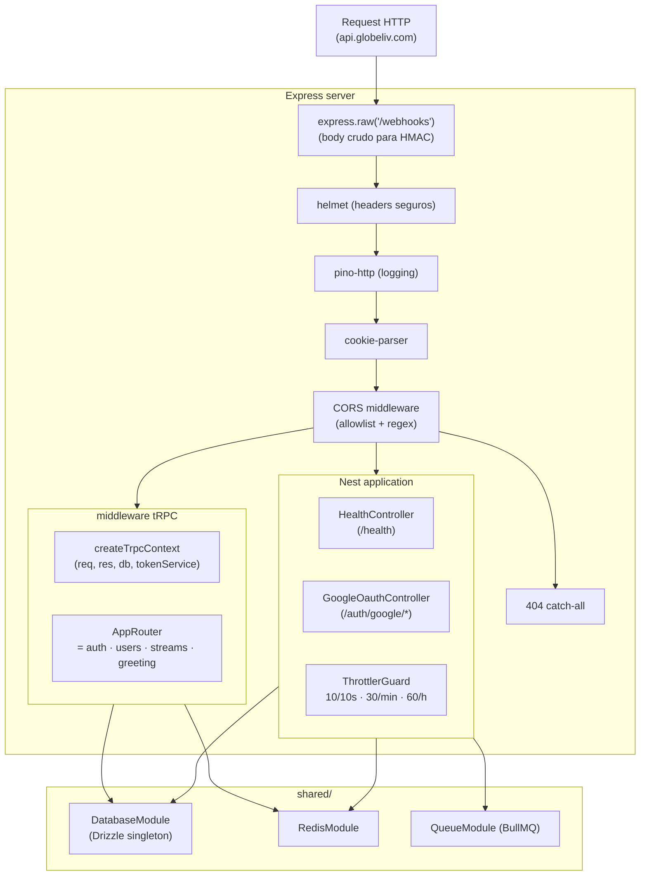
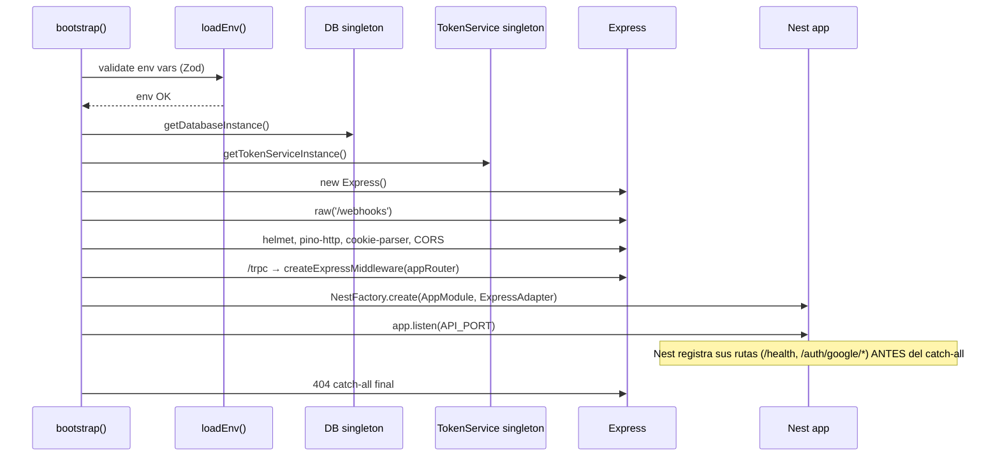
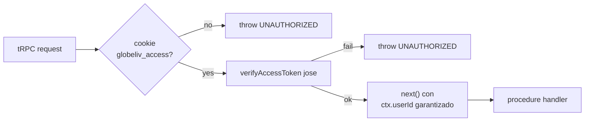

# Flujo Backend (NestJS)

> Cómo está armado `apps/api`. NestJS sobre Express + tRPC middleware (no controllers REST salvo OAuth + webhooks). El video nunca pasa por aquí — solo metadata, tokens y lógica.

---

## 🏗 Arquitectura interna



---

## 📂 Layout del código

```
apps/api/src/
├── main.ts                  ← bootstrap (NestFactory + express + tRPC)
├── app.module.ts            ← módulo raíz Nest
├── env.ts                   ← Zod schema de env vars
│
├── lib/
│   ├── jwt.ts               ← signAccessToken / verifyAccessToken (jose)
│   ├── oauth.ts             ← cliente arctic (Google) + helpers cookies
│   └── logger.ts            ← Pino con PII redaction
│
├── trpc/
│   ├── trpc.ts              ← initTRPC + middleware isAuthenticated
│   ├── context.ts           ← createTrpcContext({req, res, db, tokenService})
│   ├── app-router.ts        ← merge de routers
│   └── routers/
│       ├── auth.router.ts
│       ├── users.router.ts
│       ├── streams.router.ts
│       └── greeting.router.ts
│
├── modules/
│   ├── health/              ← HealthController
│   ├── oauth/               ← GoogleOauthController (REST por redirects)
│   └── streams/             ← TokenService (mock + real + singleton)
│       ├── token-service.interface.ts
│       ├── mock-agora-token.service.ts
│       ├── real-agora-token.service.ts
│       ├── instance.ts
│       ├── uid.ts
│       └── streams.module.ts
│
└── shared/
    ├── database/            ← Drizzle DB singleton + DatabaseModule
    ├── redis/               ← RedisModule
    └── queue/               ← QueueModule (BullMQ producer)
```

---

## 🚀 Bootstrap — `main.ts`

Orden de operaciones al arrancar:



> El orden es importante: `raw('/webhooks')` antes de cualquier JSON parser. Nest se monta después del tRPC. El catch-all se añade **después** de `app.listen` (sino tapa las rutas Nest).

---

## 🎯 tRPC vs REST — cuándo cada uno

**Default: tRPC.** Tipos end-to-end, validación Zod automática, batch links.

**Excepciones que usan REST controllers Nest:**

| Endpoint | Por qué REST |
|---|---|
| `GET /health` | Health checks de Railway esperan endpoint plano |
| `GET /auth/google/start` | OAuth funciona con redirects top-level, no AJAX |
| `GET /auth/google/callback` | Idem |
| `POST /webhooks/stripe` (futuro) | HMAC verification sobre body crudo |

Todo lo demás (auth.signup, streams.create, etc.) es tRPC.

---

## 🛡 `protectedProcedure` middleware

**Archivo:** `apps/api/src/trpc/trpc.ts`



El `ctx.userId` queda **garantizado no-null** en cada procedure que extiende `protectedProcedure`. La regla multi-tenant del `CLAUDE.md §8` usa este `ctx.userId` en cada `WHERE`.

Detalle: [[Seguridad y Auth]].

---

## 🗄 Singletons — DB y TokenService

Dos consumidores acceden a estos servicios:
- **Nest DI** (via `useFactory` providers)
- **tRPC context** (vive fuera del DI container porque el middleware tRPC se monta en Express directo)

**Solución:** singleton-factory en módulo separado:

```ts
// shared/database/instance.ts
let cached: { db: Database } | undefined;
export function getDatabaseInstance() {
  cached ??= { db: createDb(env.DATABASE_URL) };
  return cached;
}

// modules/streams/instance.ts — mismo patrón
let cached: TokenService | undefined;
export function getTokenServiceInstance(): TokenService {
  cached ??= env.AGORA_USE_MOCK
    ? new MockAgoraTokenService()
    : new RealAgoraTokenService();
  return cached;
}
```

Beneficio: **un solo pool de conexiones DB**, **un solo TokenService** entre Nest y tRPC.

---

## 🚦 Throttler — rate limit

Configurado en `AppModule`:

```ts
ThrottlerModule.forRoot([
  { name: 'short', ttl: 10_000, limit: 10 },   // 10/10s burst
  { name: 'medium', ttl: 60_000, limit: 30 },  // 30/min sostenido
  { name: 'long', ttl: 3_600_000, limit: 60 }, // 60/hora
]);
```

Aplicado globalmente vía `APP_GUARD = ThrottlerGuard`. **Excepciones** por endpoint usando `@Throttle({...})`.

Por IP (X-Forwarded-For confiable porque Railway maneja el proxy).

---

## 📋 Validación de input — Zod en boundaries

Todo input que entra al sistema pasa por Zod **una vez**, en el límite:

- **tRPC procedures:** `.input(zodSchema)`
- **HTTP controllers:** `@UsePipes(new ZodValidationPipe(schema))` (cuando lleguen)
- **Webhooks:** body crudo verifica HMAC primero, luego parsea con Zod
- **env vars:** Zod en `env.ts` al boot (la app no arranca con env inválido)

Schemas compartidos en `packages/zod-schemas/`. El frontend importa los **mismos schemas** → un solo lugar para reglas.

---

## ⚠️ Workaround NestJS 11 + Express 4

**Síntoma:** `ExpressAdapter.isMiddlewareApplied` accede a `app.router` (deprecado en Express 4).

**Fix:** override a "siempre false" en `main.ts`:

```ts
(ExpressAdapter.prototype as unknown as { isMiddlewareApplied: () => boolean })
  .isMiddlewareApplied = () => false;
```

Quitar cuando Nest 11 soporte Express 4 nativamente o pasemos a Express 5.

---

## 🧪 Tooling

- **Lint:** `pnpm --filter @globeliv/api lint`
- **Typecheck:** `pnpm --filter @globeliv/api typecheck`
- **Dev:** `pnpm --filter @globeliv/api dev` (tsx watch + `.env`)
- **Build:** `pnpm --filter @globeliv/api build` (tsup → `dist/main.js`)
- **Audit:** `pnpm exec nestjs-doctor .` (antes de cada commit que toque `apps/api`)

---

## 🔗 Notas relacionadas

- [[Flujo Frontend (Next.js)]] — el otro lado del tRPC
- [[Flujo End-to-End — Auth]] — auth.router en acción
- [[Flujo End-to-End — Streaming]] — streams.router en acción
- [[Modelo de Datos]] — schemas que el backend escribe/lee
- [[Seguridad y Auth]] — JWT, CORS, throttler, helmet
- [[Sprint 1 — Sistema de Auth]] — implementación detallada
