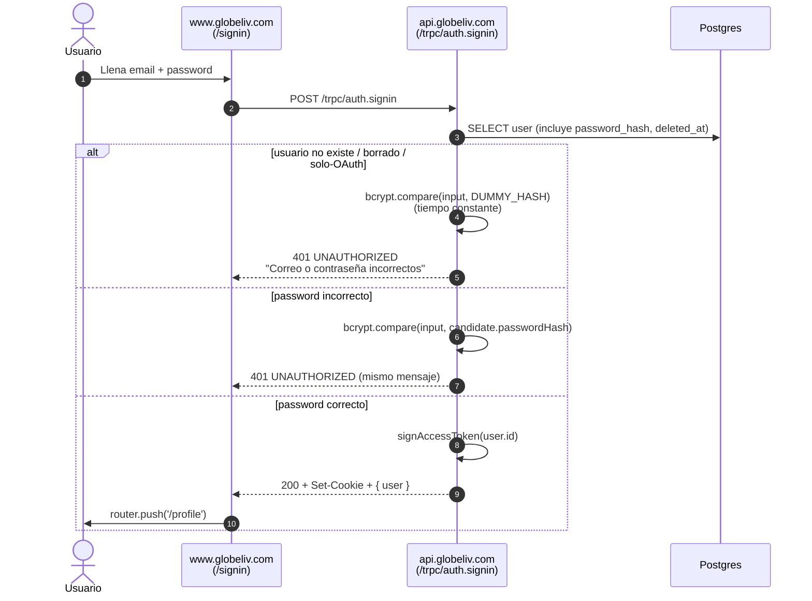
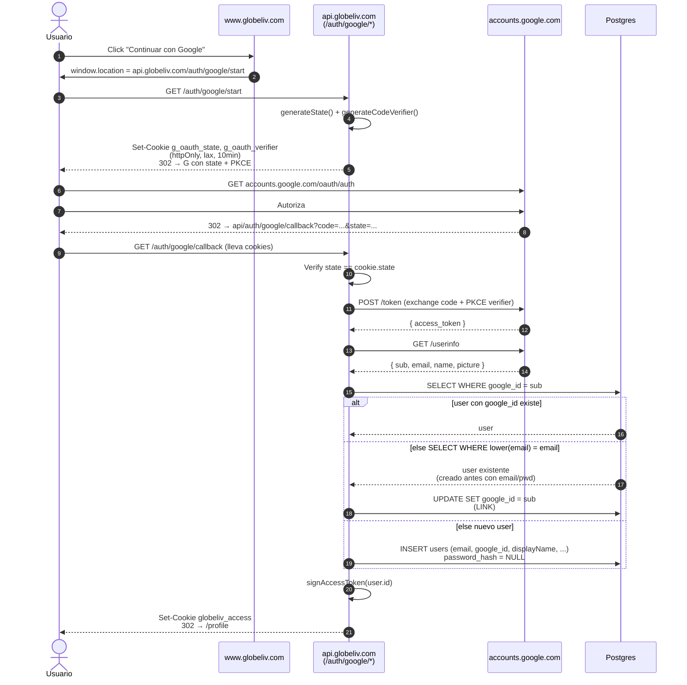
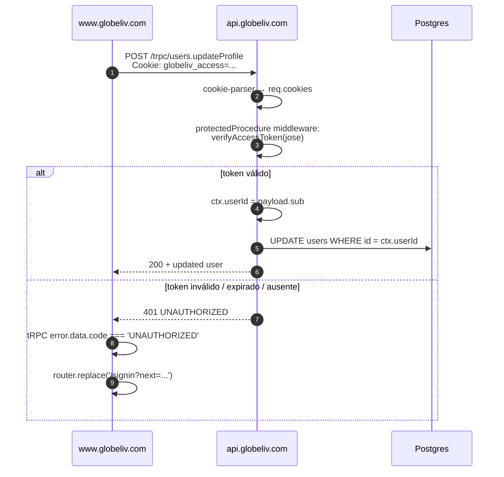

# Flujo End-to-End — Auth

> Las **3 secuencias críticas** de autenticación con diagramas paso a paso: signup (con auto-login), signin, Google OAuth. La 4ª (logout) es trivial — clear cookie.

---

## 🔐 Secuencia 1 — Signup (email + password)

```mermaid
sequenceDiagram
    autonumber
    actor U as Usuario (browser)
    participant W as www.globeliv.com<br/>(Next /login)
    participant A as api.globeliv.com<br/>(/trpc/auth.signup)
    participant DB as Postgres

    U->>W: Llena form (email, password, displayName)
    W->>W: react-hook-form + Zod valida client-side
    W->>A: POST /trpc/auth.signup<br/>credentials: include
    A->>A: signupInput.parse() Zod re-validate
    A->>DB: SELECT WHERE lower(email) = ?
    DB-->>A: 0 rows (no existe)
    A->>A: bcrypt.hash(password, cost=10)
    A->>DB: INSERT users RETURNING { id, email, displayName, ... }
    DB-->>A: user creado
    A->>A: signAccessToken(user.id)<br/>HS256, iss/aud/exp claims
    A-->>W: 200 + Set-Cookie globeliv_access<br/>HttpOnly; Secure; SameSite=Lax
    W->>W: TanStack invalida cache auth.me
    W->>U: router.push('/profile')
```

### Casos de error mapeados

| Situación | Status / Code | UI mostrará |
|---|---|---|
| Email ya existe | `CONFLICT` | "Este correo ya está registrado" |
| Email/password malformados (Zod) | `BAD_REQUEST` | Mensaje del field error |
| DB caída | `INTERNAL_SERVER_ERROR` | "No se pudo crear el usuario" |

---

## 🔐 Secuencia 2 — Signin (email + password)



### Por qué el DUMMY_HASH

User enumeration: si "user no existe" responde rápido y "password incorrecto" responde lento (bcrypt tarda ~80ms), un atacante puede deducir qué emails existen.

**Fix:** cuando el user no existe, igualmente corremos `bcrypt.compare(input, DUMMY_HASH)` → mismo tiempo de respuesta.

Detalle: [[Sprint 1 — Sistema de Auth]] sección "bcryptjs — hashing".

---

## 🔐 Secuencia 3 — Google OAuth con account linking



### 3 ramas de decisión

| Caso | Acción | Resultado |
|---|---|---|
| `google_id` ya existe | Login directo | Token emitido |
| Email ya existe (otro signup) | **LINK** — set `google_id` en el row existente | Mismo user, ahora con dos métodos de login |
| Ninguno | Crear nuevo user con `password_hash = NULL` | User solo-OAuth |

> Por qué el linking automático: UX más suave. Si el user creó cuenta con email y luego entra con Google al mismo email, no le forzamos "ya existe, signin primero". Riesgo: si un atacante crea cuenta con email de víctima y la víctima luego entra con Google → atacante perdió acceso (no tiene el OAuth de Google). **El email verificado de Google es la prueba de identidad.**

---

## 🛡 Verificación en cada request autenticado

Después del signup/signin/OAuth, **cada llamada protegida** sigue este patrón:



---

## 🍪 Por qué la cookie funciona cross-domain

`www.globeliv.com` (Vercel) y `api.globeliv.com` (Railway) **comparten eTLD+1** = `globeliv.com`. Con eso:

- `sameSite: 'lax'` permite que la cookie viaje en navegaciones top-level + XHR a otros subdominios del mismo eTLD+1
- `credentials: 'include'` en el cliente fetch la incluye en CORS requests
- CORS del API tiene `Access-Control-Allow-Credentials: true` + `Access-Control-Allow-Origin: <origen exacto>` (no `*`)

> Si frontend y API estuvieran en **eTLD+1 distintos** (ej. `globeliv.com` + `globeliv-api.com`), tendríamos que volver a `sameSite: 'none' + partitioned: true` (CHIPS) — esto fue el bug del Sprint 1. Ver [[Sprint 1 — CORS y Cookies cross-domain]].

---

## 🔗 Notas relacionadas

- [[Seguridad y Auth]] — detalles de JWT, bcrypt, cookies (referencia técnica)
- [[Sprint 1 — Sistema de Auth]] — implementación con código
- [[Sprint 1 — Profile, Settings y OAuth]] — UI del OAuth
- [[Sprint 1 — CORS y Cookies cross-domain]] — historia del bug
- [[Modelo de Datos]] — schema `users` con `google_id`, `password_hash` nullable
