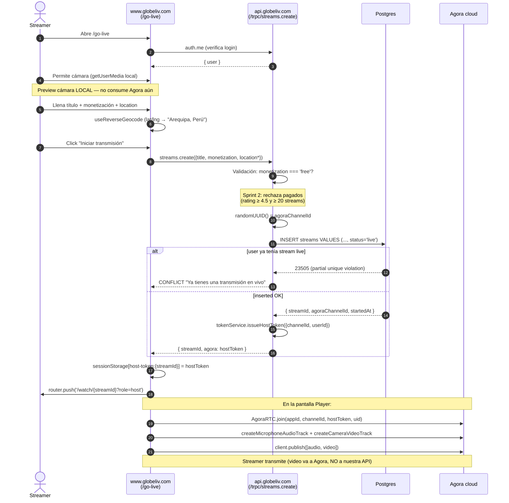
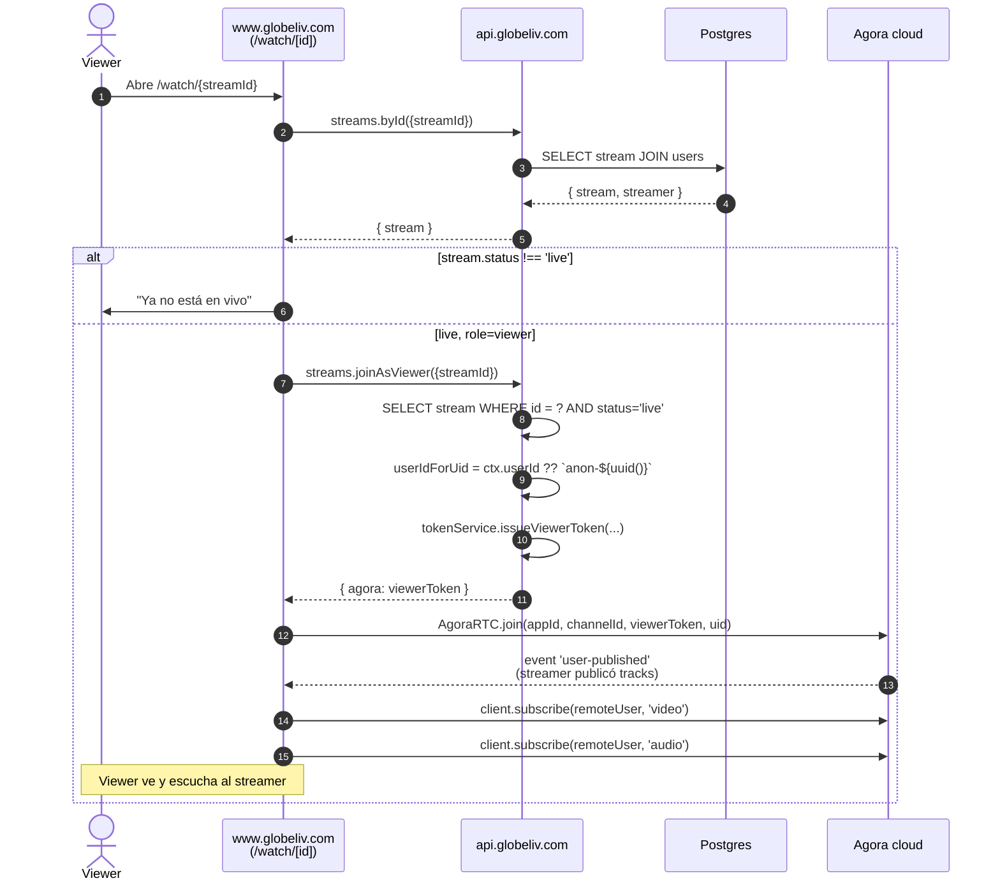
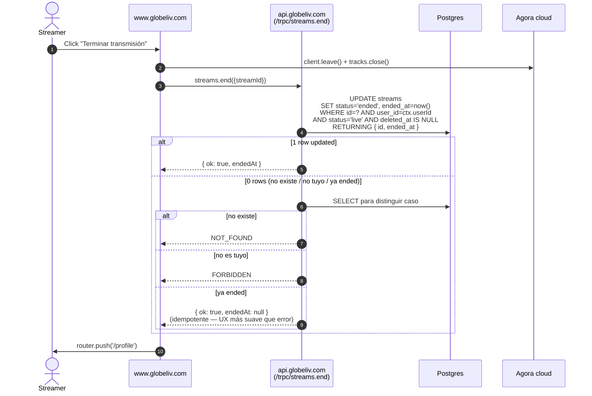
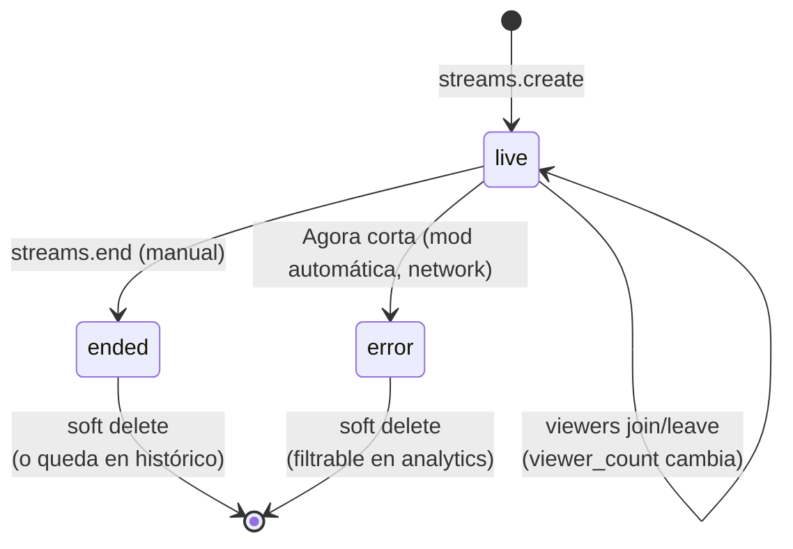

# Flujo End-to-End — Streaming

> El core del producto. **El video NUNCA pasa por nuestros servers** — Agora hace todo el RTC. Nosotros solo emitimos tokens firmados y guardamos metadata.

---

## 🎬 Secuencia 1 — Go Live (streamer crea transmisión)

### Decisiones críticas

| Decisión | Razón |
|---|---|
| `agora_channel_id` = `randomUUID()` server-side | No leakear identificadores internos al SDK Agora |
| Partial unique `(user_id) WHERE status='live'` | DB enforcea "1 live por user" — sin race condition |
| Mock token service | Demos funcionan sin credenciales Agora — ver [[Sprint 2 — Agora Token Service (mock + real)]] |
| hostToken en sessionStorage entre /go-live y /watch | TTL 4h del token, evita viaje extra al server |

---

## 📺 Secuencia 2 — Viewer ve el stream

### Por qué `streams.byId` separado de `streams.joinAsViewer`

- **Separación de concerns:** lectura (cacheable, no efecto colateral) vs emisión de token (mutación)
- **UX:** si el stream ya terminó (`status='ended'`), el viewer ve la pantalla "ya no está en vivo" **sin gastar un viewerToken** para nada
- **Share links:** mandar `/watch/xyz` a alguien funciona aunque el stream haya terminado — no rompe

### Por qué viewer anónimo está permitido (Sprint 2)

`joinAsViewer` es `publicProcedure` (no `protected`). Razón:
- Share-link friendly — alguien que recibe el link no tiene que registrarse para mirar
- `uid` efímero `anon-${uuid()}` por sesión — Agora lo trata como viewer único
- Si aparece abuso (bots, scraping), Sprint 4+ endurece con rate-limit por IP

---

## 🛑 Secuencia 3 — End stream (host termina)

### Por qué `UPDATE … WHERE precondición RETURNING`

Operación **atómica** — la transición `live → ended` no permite doble end. Si el usuario hace doble tap al botón:

- Request 1: UPDATE pasa → `live → ended`. Devuelve `ok`.
- Request 2: UPDATE no afecta filas (precondición `status='live'` ya no se cumple) → fallback idempotente devuelve `ok`.

Mejor UX que un toast de error.

---

## 📊 Diagrama de estados de un stream

`error` se separa de `ended` para poder filtrar "streams buenos" en analytics y replays.

---

## 🚀 Por qué este diseño aguanta tráfico

Aplicando §11.1 del CLAUDE.md ("escalabilidad como criterio único"):

| Carga | Mecanismo | Aguanta |
|---|---|---|
| Video bidireccional | Agora cloud lo maneja, no nosotros | Cientos de miles de streams concurrentes |
| Lista Home (listLive) | Index `(status, started_at desc)` | Millones de streams ended sin afectar la query |
| Emisión de tokens | Stateless, ~5ms por token | Cientos por segundo en una sola instancia |
| Viewer count realtime | Sprint 3: Redis pub/sub (hot path) | 10k+ updates por segundo |
| Chat realtime | Sprint 3: Socket.io con adaptador Redis | 1k+ msg/seg por stream |

> El cuello de botella **no es nuestro stack** — es Agora (cuando lleguemos a 10k+ streams concurrentes negociamos plan enterprise) y Redis (clustering trivial cuando aplique).

---

## 🔗 Notas relacionadas

- [[Modelo de Datos]] — schema `streams` + indexes
- [[Sprint 2 — Schema de Streams]] — diseño de la tabla con razones
- [[Sprint 2 — tRPC Streams Router]] — código de los procedures
- [[Sprint 2 — Agora Token Service (mock + real)]] — patrón mock/real
- [[Sprint 2 — Pantallas Go Live y Watch]] — frontend
- [[Pantalla 4 - Go Live]], [[Pantalla 3 - Player de Stream]] — spec de producto
