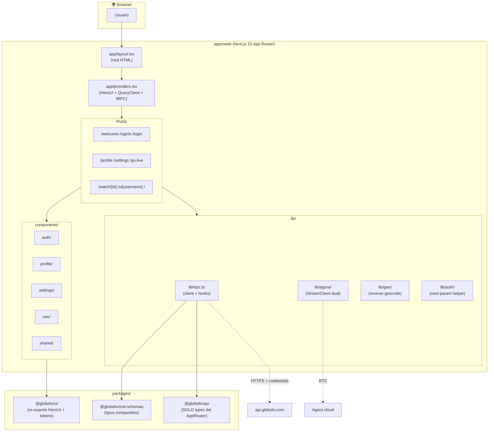
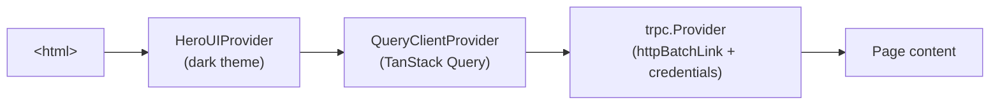

# Flujo Frontend (Next.js)

> Cómo está armado `apps/web`. Routing, providers, comunicación con backend, design system.

---

## 🏗 Arquitectura interna



---

## 📂 Layout del código

```
apps/web/
├── next.config.ts
├── postcss.config.mjs        ← Tailwind 4
├── next-env.d.ts
└── src/
    ├── app/                  ← App Router
    │   ├── layout.tsx        ← root layout + fuentes next/font
    │   ├── providers.tsx     ← HeroUIProvider + QueryClient + tRPC
    │   ├── page.tsx          ← / (Home Explorar)
    │   ├── globals.css       ← importa tokens.css
    │   │
    │   ├── welcome/page.tsx
    │   ├── signin/page.tsx
    │   ├── login/page.tsx    ← signup con auto-login
    │   ├── profile/page.tsx
    │   ├── settings/page.tsx
    │   ├── go-live/
    │   │   ├── page.tsx
    │   │   └── _components/
    │   ├── watch/[id]/
    │   │   ├── page.tsx
    │   │   └── _components/
    │   ├── u/[username]/page.tsx
    │   └── _components/      ← StreamCard, Filters (locales a Home)
    │
    ├── components/           ← componentes compartidos
    │   ├── auth/
    │   ├── profile/
    │   ├── settings/
    │   ├── nav/              ← bottom-nav (mobile), top-nav (desktop)
    │   └── shared/           ← BgDecoration, etc.
    │
    └── lib/
        ├── trpc.ts           ← cliente tRPC + hooks tipados
        ├── agora/            ← cliente RTC dual (mock + real)
        ├── geo/              ← useReverseGeocode hook
        └── auth/             ← next-param redirect helper
```

---

## 🌀 Providers (raíz)

**Archivo:** `apps/web/src/app/providers.tsx`



- **HeroUIProvider** — theme + portal context para modales/dropdowns
- **QueryClientProvider** — cache de TanStack Query (refetch, mutations, etc.)
- **trpc.Provider** — wraps QueryClient con tRPC; los hooks `trpc.X.useQuery()` salen de aquí

---

## 📡 Cliente tRPC

**Archivo:** `apps/web/src/lib/trpc.ts`

```ts
import { createTRPCReact } from "@trpc/react-query";
import { httpBatchLink } from "@trpc/client";
import type { AppRouter } from "@globeliv/api/trpc";

export const trpc = createTRPCReact<AppRouter>();

export const trpcClient = trpc.createClient({
  links: [
    httpBatchLink({
      url: `${process.env.NEXT_PUBLIC_API_URL}/trpc`,
      fetch: (url, opts) => fetch(url, { ...opts, credentials: "include" }),
      // ↑ credentials: 'include' es CRÍTICO para que la cookie viaje
    }),
  ],
});
```

**Cómo se usa en una página cliente:**

```tsx
"use client";
const me = trpc.auth.me.useQuery(undefined, { retry: false });
const updateProfile = trpc.auth.updateProfile.useMutation();
```

---

## 🛡 Rutas protegidas (patrón)

No usamos middleware Next.js para auth. En su lugar, **client-side guard** en el page:

```tsx
"use client";
const me = trpc.auth.me.useQuery(undefined, { retry: false });

useEffect(() => {
  if (me.error?.data?.code === "UNAUTHORIZED") {
    router.replace("/signin?next=/profile");
  }
}, [me.error, router]);

if (me.isLoading || !me.data) return <Spinner />;
return <ProtectedContent user={me.data} />;
```

**Por qué client-side y no middleware:**
- El backend ya valida cookie en `protectedProcedure` → middleware Next sería duplicación
- Permite mostrar UI optimista mientras carga
- Mejor UX: el splash + spinner es el mismo que el resto de la app

> Trade-off: hay un flash de página vacía antes del redirect. Aceptable para Sprint 1; si crece a >3 pantallas protegidas con flash visible, evaluamos middleware con `cookies()` de Next.

---

## 🎨 Design tokens

**Archivo:** `packages/ui/src/tokens.css` (importado en `app/globals.css`)

Tailwind 4 `@theme` directive. **Prohibido `#hex` en componentes** — siempre `var(--color-brand-*)` o utility `bg-brand-red`.

Detalle de la paleta: [[Sprint 1 — Profile, Settings y OAuth]] (sección "Kinetic v1").

---

## 📦 Importaciones — regla de oro

```ts
// ✅ Bien
import { Button, Card } from "@globeliv/ui";

// ❌ Mal — bypass del barrel
import { Button } from "@heroui/react";
```

Razones:
- `@globeliv/ui` puede inyectar wrappers (telemetría, accessibility defaults)
- Cambio de UI lib (si pasara) toca un solo archivo

Esta regla viene del CLAUDE.md §11.2 (HeroUI primero). Ver [[heroui_first]].

---

## ⚡ Server Components vs Client Components

| Tipo | Cuándo |
|---|---|
| **Server** (default) | Layouts, fetching estático, SEO |
| **Client** (`"use client"`) | Cualquier cosa con `useState`, `useEffect`, hooks tRPC, `framer-motion`, eventos |

En Sprint 0-2, **la mayoría de páginas son Client** porque dependen de hooks tRPC + estado de auth. El `layout.tsx` raíz sí es server.

> Optimización futura: precargar metadata pública (ej. `streams.byId` en `/watch/[id]`) desde el RSC con `revalidate` cortos. Diferido a post-MVP.

---

## 🧪 Tooling

- **Lint:** `pnpm --filter @globeliv/web lint` (eslint + import sorting)
- **Typecheck:** `pnpm --filter @globeliv/web typecheck`
- **Dev:** `pnpm --filter @globeliv/web dev` (puerto 3000)
- **Build:** `pnpm --filter @globeliv/web build` (output `.next/`)

---

## 🔗 Notas relacionadas

- [[Flujo Backend (NestJS)]] — el otro lado del tRPC
- [[Flujo End-to-End — Auth]] — cómo el cliente maneja signup/signin
- [[Seguridad y Auth]] — cookies, CORS desde la perspectiva del cliente
- [[Sprint 1 — Profile, Settings y OAuth]] — qué componentes UI existen
- [[Sprint 2 — Pantallas Go Live y Watch]] — pantallas más complejas
