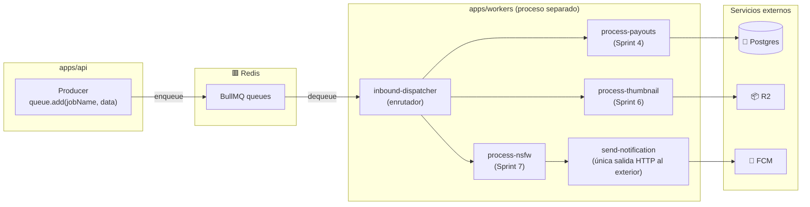

# Flujo Workers (BullMQ)

> Proceso separado de la API. Consume jobs desde Redis (BullMQ). En Sprint 0-2 es **scaffold** — los workers reales aparecen en Sprint 6 (FCM) y Sprint 7 (NSFW.js).

---

## 🏗 Arquitectura



---

## 🤔 Por qué workers separados de la API

Regla §11.1 del CLAUDE.md: **cero trabajo síncrono pesado en el request HTTP** (cualquier operación >200ms va a cola).

| Razón | Detalle |
|---|---|
| **Aislamiento de carga** | Un pico de notificaciones no degrada la latencia del API |
| **Scaling independiente** | Railway puede correr 1× api + Nx workers |
| **Idempotencia natural** | Jobs con `jobId` determinístico — replay seguro |
| **Retry built-in** | BullMQ maneja exponential backoff sin código custom |
| **Tipos de cargas distintas** | API: latencia baja. Workers: throughput, tolerantes a delay |

---

## 📂 Layout del código

```
apps/workers/
├── src/
│   ├── index.ts           ← bootstrap (conecta a Redis, spawn workers)
│   ├── env.ts             ← Zod env validation
│   ├── lib/
│   │   └── logger.ts      ← Pino con PII redaction (compartido con api)
│   ├── queues/            ← definiciones de queues
│   └── workers/
│       ├── inbound-dispatcher.ts   ← enrutador maestro (futuro)
│       └── (workers concretos llegan en sprints 4-7)
├── package.json
└── tsconfig.json
```

---

## 🔧 Estado actual (Sprint 0-2)

**Scaffold listo, workers reales aún no.**

Lo que existe hoy:
- Conexión IORedis al boot
- Pino logger configurado
- Esqueleto para registrar workers
- `package.json` con `bullmq`, `ioredis`, `pino`, `zod`

Lo que **no existe** todavía:
- Definición de queues concretas
- Workers ejecutándose

Estos llegan **just-in-time** cuando un sprint los necesita.

---

## 📋 Convenciones que se aplicarán a TODO worker

Cuando se introduzca el primer worker real (Sprint 4 con Stripe payouts probablemente):

### 1. Job IDs determinísticos

```ts
// ❌ Mal: replay duplicado de webhook crea dos jobs
await queue.add('process-payout', { tipId: '...' });

// ✅ Bien: replay encuentra job existente y no encola
await queue.add('process-payout', { tipId: '...' }, { jobId: `payout:${tipId}` });
```

Razón: webhooks de Stripe pueden llegar duplicados. Job ID = "payout:<tipId>" → BullMQ deduplica.

### 2. Idempotencia en el handler

```ts
async function processPayout({ tipId }) {
  // SELECT con FOR UPDATE → bloqueo de fila
  const tip = await db.query.tips.findFirst({
    where: eq(tips.id, tipId),
    for: 'update',
  });
  if (tip.payoutStatus === 'completed') return;  // ← ya procesado
  // … procesar …
  await db.update(tips).set({ payoutStatus: 'completed' }).where(eq(tips.id, tipId));
}
```

### 3. Retry con backoff exponencial

```ts
queue.add('job', data, {
  attempts: 5,
  backoff: { type: 'exponential', delay: 1000 },  // 1s, 2s, 4s, 8s, 16s
});
```

### 4. Validación Zod del payload

El payload del job viaja por JSON → Redis → JSON. Validar con Zod al consumir:

```ts
const payload = jobDataSchema.parse(job.data);
```

Si llega un payload inválido (versión vieja del producer en deploy parcial) → job falla con error claro en log.

---

## 🛣 Roadmap de workers por sprint

| Sprint | Worker | Función |
|---|---|---|
| 4 | `process-stripe-webhook` | Verifica HMAC, encola sub-jobs |
| 4 | `process-payout` | Mueve $ desde wallet a Stripe Connect account |
| 5 | `process-mission-match` | Cuando alguien crea misión, busca streamers cercanos |
| 6 | `send-fcm-notification` | Push (única salida HTTP al exterior) |
| 6 | `capture-thumbnail` | Llama Agora REST API → sube a R2 |
| 7 | `process-nsfw` | Corre NSFW.js sobre frame del stream → reporta |
| 7 | `process-report` | Cuando viewer reporta stream, escalado a admin |

---

## 🔗 Notas relacionadas

- [[Flujo Backend (NestJS)]] — el producer de jobs
- [[Modelo de Datos]] — tablas que workers leen/escriben
- [[Topología de Despliegue]] — workers corren en su propio Railway service
- `Globeliv/CLAUDE.md` §11.1 — escalabilidad como criterio único
