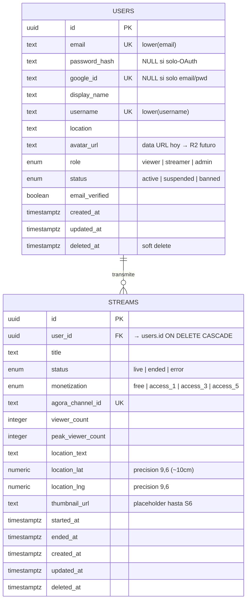

# Modelo de Datos

> Schema vivo (Postgres 17 + Drizzle 0.38). Sprint 0-2 tiene **2 tablas**: `users` + `streams`. El resto entra cuando su sprint las pida.

---

## 🗂 ER actual



---

## 👤 `users`

**Schema:** `Globeliv/packages/database/src/schema/users.ts`

### Columnas

| Columna | Tipo | Notas |
|---|---|---|
| `id` | `uuid` PK | `default gen_random_uuid()` |
| `email` | `text NOT NULL` | identidad natural |
| `password_hash` | `text` | NULL si user es solo-OAuth |
| `google_id` | `text` | NULL si user es solo email/password |
| `display_name` | `text NOT NULL` | mostrado en UI |
| `username` | `text` | nullable hasta onboarding |
| `location` | `text` | "Lima, Perú" |
| `avatar_url` | `text` | data URL hoy (cap 150KB), R2 futuro |
| `role` | enum `user_role` | `viewer` \| `streamer` \| `admin` |
| `status` | enum `user_status` | `active` \| `suspended` \| `banned` |
| `email_verified` | `boolean DEFAULT false` | |
| `created_at` | `timestamptz` | |
| `updated_at` | `timestamptz` | `$onUpdateFn` |
| `deleted_at` | `timestamptz` | soft delete |

### Indexes

| Nombre | Tipo | Sobre |
|---|---|---|
| `users_email_unique_idx` | UNIQUE funcional | `lower(email)` |
| `users_username_unique_idx` | UNIQUE funcional | `lower(username)` (NULLs no chocan) |
| `users_google_id_unique_idx` | UNIQUE | `google_id` (NULLs no chocan) |
| `users_role_idx` | BTREE | `role` |
| `users_status_idx` | BTREE | `status` |

> Postgres no incluye NULLs en uniqueness por default → varios users pueden tener `username = NULL` o `google_id = NULL` sin chocar. Solo cuando se setea el valor, debe ser único.

---

## 🎥 `streams`

**Schema:** `Globeliv/packages/database/src/schema/streams.ts`

### Columnas

| Columna | Tipo | Notas |
|---|---|---|
| `id` | `uuid` PK | |
| `user_id` | `uuid NOT NULL` | FK → users.id ON DELETE CASCADE |
| `title` | `text NOT NULL` | mostrado en Home + Player |
| `status` | enum `stream_status` | `live` \| `ended` \| `error` |
| `monetization` | enum `monetization_level` | `free` \| `access_1` \| `access_3` \| `access_5` |
| `agora_channel_id` | `text NOT NULL` | UUID server-side |
| `viewer_count` | `integer DEFAULT 0` | snapshot — hot-path va a Redis en S3 |
| `peak_viewer_count` | `integer DEFAULT 0` | máximo histórico |
| `location_text` | `text` | "Arequipa, Perú" |
| `location_lat` | `numeric(9, 6)` | precision ~10cm |
| `location_lng` | `numeric(9, 6)` | usado para filtro "Cerca" (S3+) |
| `thumbnail_url` | `text` | placeholder hasta S6 |
| `started_at` | `timestamptz` | |
| `ended_at` | `timestamptz` | NULL hasta status != live |
| `created_at`, `updated_at`, `deleted_at` | `timestamptz` | obligatorias |

### Indexes

| Nombre | Tipo | Para qué |
|---|---|---|
| `streams_channel_unique_idx` | UNIQUE | Channel ID único — Agora no recicla |
| `streams_status_started_idx` | BTREE compound | Home: `WHERE status='live' ORDER BY started_at DESC` |
| `streams_user_started_idx` | BTREE compound | Perfil de streamer: historial ordenado |
| `streams_one_live_per_user_idx` | **PARTIAL UNIQUE** | `(user_id) WHERE status='live' AND deleted_at IS NULL` — enforcea "1 live por user" a nivel DB |

> El partial unique es la estrella de la tabla. Sin él, "1 live por user" se valida en código (`SELECT count + INSERT`) → race condition. Con él, Postgres rechaza el segundo INSERT con `23505` → router mapea a `CONFLICT`.

---

## 🎯 Reglas que aplican a TODA tabla (presente y futura)

Vienen del `CLAUDE.md §8` y se enforcean en cada schema nuevo:

1. **`id` UUID PK** con `gen_random_uuid()` — no autoincrement
2. **Triple timestamp obligatorio:** `created_at`, `updated_at`, `deleted_at` (todas `timestamptz`)
3. **Soft delete por default** — TODO read filtra `deleted_at IS NULL`. NUNCA `DELETE` físico salvo GDPR
4. **`updated_at` con `$onUpdateFn`** — Drizzle lo setea automático
5. **Indexes en el mismo PR que la query** — la feature que lee por `(status, started_at)` agrega ese index junto
6. **Multi-tenant:** toda query a tabla con `user_id` lleva `WHERE user_id = ${ctx.userId}` — sin excepciones
7. **Foreign keys con `ON DELETE` explícito** — `CASCADE` si la fila no tiene sentido sin el padre, `SET NULL` para opcional

---

## 📜 Migraciones aplicadas

**Carpeta:** `Globeliv/packages/database/migrations/`

| Archivo | Fecha | Contenido |
|---|---|---|
| `0000_fancy_kat_farrell.sql` | 2026-05-25 | Tabla `users` + enums + indexes iniciales |
| `0001_flat_zarda.sql` | 2026-05-26 | Agrega `users.location` + unique index `username` |
| `0002_amazing_whistler.sql` | 2026-05-26 | `password_hash` nullable + `google_id` + index |
| `0003_productive_ken_ellis.sql` | 2026-05-27 | Tabla `streams` + 4 indexes |

---

## 🛣 Tablas que llegan en sprints futuros

> Listadas para visibilidad — **no** existen aún. Detalle por sprint:

| Sprint | Tablas | Cuándo |
|---|---|---|
| 3 | `chat_messages`, `follows`, `reactions` | Interacción social |
| 4 | `tips`, `wallets`, `payouts`, `paid_accesses` | Stripe Connect + propinas |
| 5 | `requests` (misiones), `escrow`, `request_responses` | Marketplace bidireccional |
| 6 | `passport_visits`, `passport_badges`, `notifications`, `scheduled_events` | Pasaporte + FCM |
| 7 | `reports`, `moderation_actions`, `nsfw_detections` | Moderación |
| 8 | (sin tablas nuevas — bug fixes + perf) | — |

> Cuando una tabla aparece, **se documenta acá**, en su nota de Sprint en [[00 - Índice de Progreso]], y se actualiza el ER de la cabeza de esta nota.

---

## 🚀 Patrones de consulta que escalan

### 1. Lista de items "vivos" — usa partial-ish index

```ts
db.select().from(streams)
  .where(and(eq(streams.status, 'live'), isNull(streams.deletedAt)))
  .orderBy(desc(streams.startedAt))
  .limit(24);
```

Index `(status, started_at desc)` → Postgres devuelve sin sort.

### 2. Multi-tenant — siempre filtra por user_id

```ts
db.select().from(streams)
  .where(and(
    eq(streams.userId, ctx.userId),  // ← OBLIGATORIO
    eq(streams.status, 'live'),
  ));
```

### 3. Transición atómica — UPDATE WHERE precondición RETURNING

```ts
db.update(streams).set({ status: 'ended', endedAt: new Date() })
  .where(and(
    eq(streams.id, streamId),
    eq(streams.userId, ctx.userId),
    eq(streams.status, 'live'),  // ← precondición
  ))
  .returning({ id: streams.id });
```

Si `returning.length === 0` → la transición no aplicó (no era live, no era tuyo, no existía).

### 4. ON CONFLICT en lugar de "SELECT, IF, INSERT"

```ts
db.insert(streams).values({...})
  .onConflictDoNothing({ target: streams.agoraChannelId });
```

Idempotente naturalmente.

---

## 🛠 Comandos Drizzle

```bash
# Modificar schema (.ts) → generar migration
pnpm --filter @globeliv/database db:generate

# Aplicar al DB conectado vía DATABASE_URL
pnpm --filter @globeliv/database db:migrate

# GUI explorar/editar
pnpm --filter @globeliv/database db:studio
```

---

## 🔗 Notas relacionadas

- [[Sprint 0 — DB y Migraciones]] — setup de Drizzle + primera migration
- [[Sprint 2 — Schema de Streams]] — diseño de `streams` con razones
- [[Flujo Backend (NestJS)]] — quién lee/escribe estas tablas
- [[Seguridad y Auth]] — `password_hash` y `google_id` en contexto
