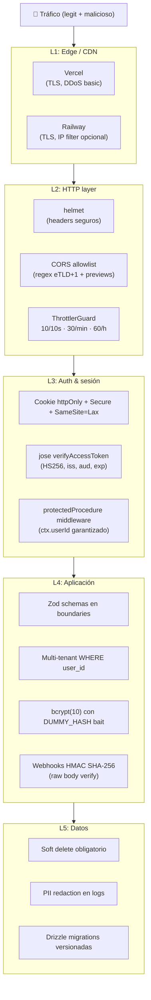

# Seguridad y Auth

> Las capas defensivas del sistema. JWT, bcrypt, CORS, cookies, OAuth, rate-limit, helmet, Zod. Referencia técnica unificada.

---

## 🛡 Modelo de capas defensivas



---

## 🔑 L3 — Autenticación

### JWT con `jose`

**Archivo:** `apps/api/src/lib/jwt.ts`

- Algoritmo: **HS256** con `JWT_SECRET` (32+ chars, validado por Zod al boot)
- Claims:
  - `iss` = `env.JWT_ISSUER` (`globeliv.com`)
  - `aud` = `env.JWT_AUDIENCE` (`globeliv-web`)
  - `sub` = `userId` (UUID del usuario)
  - `iat`, `exp` con TTL = `JWT_ACCESS_TTL_SECONDS`
- Library: `jose` (no `jsonwebtoken` — `jose` es ESM nativo + más moderno)

### Cookie

| Atributo | Valor | Razón |
|---|---|---|
| `name` | `globeliv_access` | namespace del producto |
| `httpOnly` | `true` | XSS no puede leerla |
| `secure` | `true` (prod) / `false` (dev) | TLS-only en prod |
| `sameSite` | `lax` | viaja en navegaciones top-level + XHR de mismo eTLD+1 |
| `path` | `/` | toda la app |
| `domain` | implícito (`api.globeliv.com`) | el browser la asocia al eTLD+1 `globeliv.com` |

> En Sprint 1 hubo iteración: `sameSite=none + partitioned=true` (CHIPS) cuando frontend y API estaban en eTLD+1 distintos. Tras configurar `api.globeliv.com`, se simplificó a `lax`. Historia completa: [[Sprint 1 — CORS y Cookies cross-domain]].

### `protectedProcedure` middleware

```ts
const isAuthenticated = middleware(async ({ ctx, next }) => {
  const token = ctx.req.cookies[ACCESS_COOKIE_NAME];
  if (!token) throw new TRPCError({ code: "UNAUTHORIZED" });
  const payload = await verifyAccessToken(token);
  if (!payload) throw new TRPCError({ code: "UNAUTHORIZED" });
  return next({ ctx: { ...ctx, userId: payload.userId } });
});

export const protectedProcedure = publicProcedure.use(isAuthenticated);
```

El `ctx.userId` queda **garantizado no-null** en cualquier procedure que extienda `protectedProcedure`.

### Refresh tokens — pendiente

**Sprint 1 NO tiene refresh tokens.** El access token vive con TTL extendido (días).

**Plan para Sprint 2+:**
- Refresh token con `jti` único + Redis allowlist
- `session:{jti} → userId` con TTL
- Logout invalida el `jti` (DEL key)
- Rotación de refresh en cada uso

---

## 🔐 L4 — Aplicación

### bcrypt password hashing

- **Cost = 10** (~80ms en hardware moderno) — bajo el umbral de 200ms (§11.1)
- Subir a 12 cuando haya hardware dedicado de auth

### DUMMY_HASH — anti user enumeration

```ts
const DUMMY_HASH = "$2a$10$invalidsaltinvalidsalt22fakefakefakefakefakefakefakefa";

if (!user || user.deletedAt || !user.passwordHash) {
  // No revelamos si existe / está borrado / solo-OAuth
  await bcrypt.compare(input.password, DUMMY_HASH);  // ← tiempo constante
  throw new TRPCError({ code: "UNAUTHORIZED", message: "Correo o contraseña incorrectos" });
}
```

Sin esto, "user no existe" responde rápido (~5ms) y "password incorrecto" responde lento (~80ms) → atacante deduce qué emails existen.

### Multi-tenant — query siempre con `user_id`

Regla del `CLAUDE.md §8`:

> _TODA query a tabla con `user_id` lleva `WHERE user_id = ${userId}`. Sin excepciones._

Esto se verifica manualmente en code review hoy. Pendiente: **plugin ESLint custom** que falle si una query a tabla con `user_id` no incluye el filtro. Listado en deuda técnica del Sprint 0.

### Zod en boundaries

Validación en **un solo lugar** por capa de entrada:

| Boundary | Schema |
|---|---|
| tRPC procedures | `.input(zodSchema)` |
| HTTP controllers REST | `@UsePipes(new ZodValidationPipe(schema))` (futuro) |
| Webhooks | HMAC primero → parse JSON → Zod |
| env vars | `env.ts` con Zod al boot |

Schemas compartidos en `packages/zod-schemas/` → frontend y backend usan los **mismos** schemas.

### Webhooks HMAC (preparado, no usado aún)

`main.ts` monta `express.raw('/webhooks')` ANTES de cualquier JSON parser:

```ts
server.use("/webhooks", raw({ type: "*/*", limit: "1mb" }));
```

Razón: HMAC SHA-256 se verifica sobre **bytes exactos del body**. Si Express ya parseó a JSON, la verificación falla.

Pattern para Sprint 4 (Stripe):

```ts
@Post('stripe')
async stripeWebhook(@Req() req: Request) {
  const sig = req.headers['stripe-signature'];
  const event = stripe.webhooks.constructEvent(req.body, sig, env.STRIPE_WEBHOOK_SECRET);
  // ↑ rawBody verification
  await queue.add('process-stripe-webhook', { event }, { jobId: event.id });
  return { received: true };  // 200 en <50ms
}
```

---

## 🌐 L2 — HTTP layer

### CORS allowlist

**Archivo:** `apps/api/src/main.ts`

```ts
const globelivProductionPattern = /^https:\/\/([\w-]+\.)?globeliv\.com$/u;
const vercelPreviewPattern = /^https:\/\/[\w-]+\.vercel\.app$/u;

const isAllowedOrigin = (origin: string): boolean => {
  if (staticOrigins.includes(origin)) return true;
  if (env.NODE_ENV !== "production") return false;
  return globelivProductionPattern.test(origin) || vercelPreviewPattern.test(origin);
};
```

**Permite:**
- `www.globeliv.com`, `admin.globeliv.com`, `api.globeliv.com`, etc. (cualquier subdominio)
- `*.vercel.app` (preview deploys de stakeholders)
- localhost en dev

**Headers que envía:**
- `Access-Control-Allow-Origin: <origen exacto>` (no `*`, requerido con credentials)
- `Access-Control-Allow-Credentials: true`
- `Access-Control-Allow-Methods: GET,POST,OPTIONS`
- `Vary: Origin`

### helmet

Defaults seguros:
- `Content-Security-Policy`
- `X-Frame-Options: SAMEORIGIN`
- `X-Content-Type-Options: nosniff`
- `Strict-Transport-Security`
- ... etc.

> Configuración custom de CSP pendiente cuando aparezcan inline scripts justificados (no hay hoy).

### Rate-limit (ThrottlerGuard)

3 capas:
- `short`: 10 / 10s — burst
- `medium`: 30 / min — sostenido
- `long`: 60 / hora — máximo absoluto

Por IP (X-Forwarded-For confiable porque Railway maneja el proxy).

---

## 🔐 OAuth Google

**Archivos:** `apps/api/src/lib/oauth.ts`, `apps/api/src/modules/oauth/google-oauth.controller.ts`

- Library: **arctic** (manejo de PKCE built-in)
- Flow: Authorization Code + PKCE (S256)
- Cookies temp: `g_oauth_state` y `g_oauth_verifier` (10 min, httpOnly, lax)
- Account linking automático por email verificado (ver [[Flujo End-to-End — Auth]])

---

## 🪵 L5 — Logs y PII

### PII redaction

`apps/api/src/lib/logger.ts` configura Pino con `redact`:

```ts
pino({
  redact: {
    paths: ['email', 'phone', 'password', 'token', 'authorization', '*.email', '*.password'],
    censor: '[REDACTED]',
  },
});
```

> Reforzar: hook que detecte teléfonos en `text/rawInput` y los enmascare. Listado en deuda técnica del Sprint 0. Se activa con Sprint 6 (notificaciones).

### Soft delete

`deleted_at: timestamptz | null` en TODA tabla. `DELETE` físico **prohibido** salvo:
- Compliance GDPR
- Datos genuinamente test / corruptos
- Auditado en code review

---

## ⚙️ Env vars relacionadas con seguridad

| Variable | Tipo | Notas |
|---|---|---|
| `JWT_SECRET` | string ≥32 chars | Rotable |
| `JWT_ISSUER` | string | `globeliv.com` |
| `JWT_AUDIENCE` | string | `globeliv-web` |
| `JWT_ACCESS_TTL_SECONDS` | number | TTL del access token |
| `GOOGLE_CLIENT_ID` / `_SECRET` | string | OAuth (opcional — sin esto, endpoints 503) |
| `STRIPE_WEBHOOK_SECRET` | string | Sprint 4 (HMAC) |
| `WEB_PUBLIC_URL` | string | Origin canónico permitido por CORS |
| `NODE_ENV` | enum | `production` activa cookies `secure: true` |

Validación: `env.ts` con Zod al boot. La app no arranca con config inválida.

---

## 🚧 Deuda técnica abierta

- [ ] Refresh tokens (Sprint 2+) con Redis allowlist
- [ ] Plugin ESLint multi-tenant check (`WHERE user_id` obligatorio)
- [ ] PII redaction reforzada (regex teléfonos en rawInput)
- [ ] RS256 (asimétrico) si verificación fuera del API se necesita
- [ ] CSP custom configurada con inline scripts justificados
- [ ] 2FA opcional (Sprint 6 con SMS / TOTP)

---

## 🔗 Notas relacionadas

- [[Flujo End-to-End — Auth]] — auth en acción con diagramas
- [[Sprint 1 — Sistema de Auth]] — implementación con código
- [[Sprint 1 — CORS y Cookies cross-domain]] — historia del bug cross-domain
- [[Modelo de Datos]] — schema con `password_hash`, `google_id`
- `Globeliv/CLAUDE.md` §6 — principio "seguridad por default"
