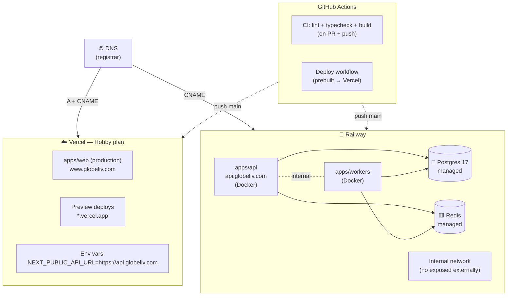
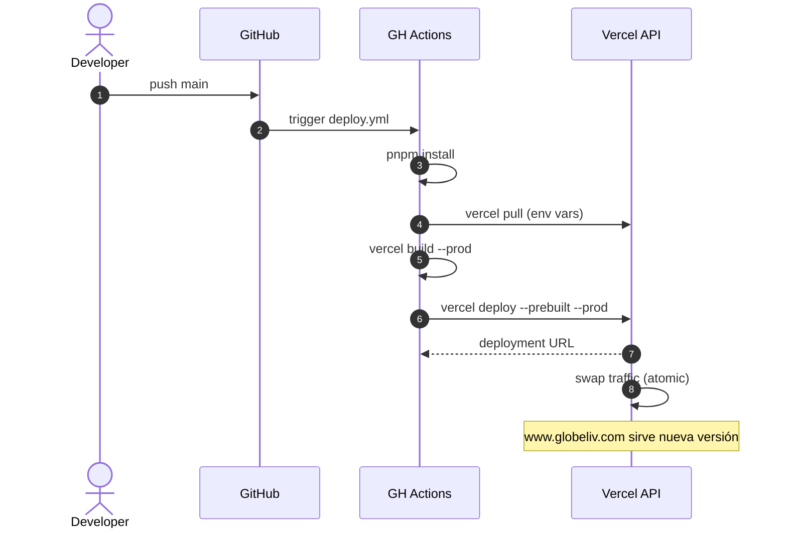
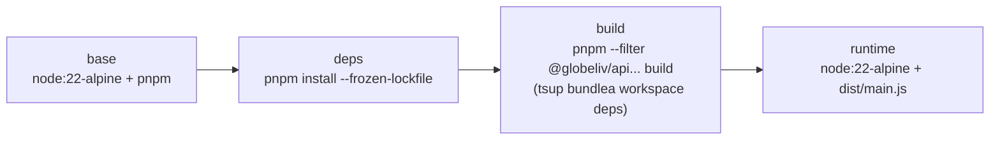
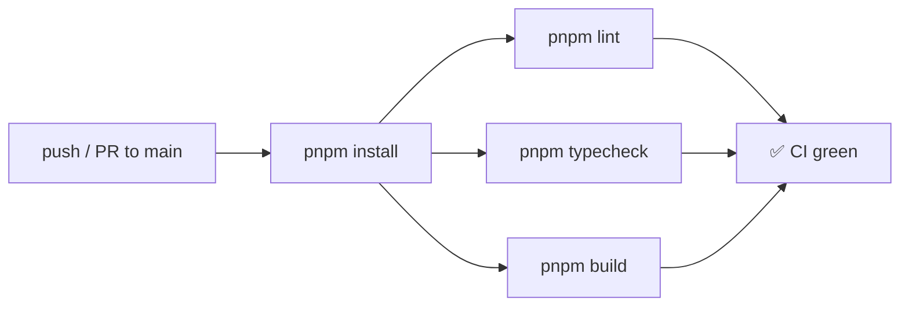

# Topología de Despliegue

> Dónde corre cada cosa en producción. DNS, hosting, base de datos, CI/CD.

---

## 🗺 Vista panorámica



---

## 🌐 DNS

| Hostname | Tipo | Apunta a | Servicio |
|---|---|---|---|
| `globeliv.com` | A + CNAME | Vercel | Frontend (redirige 307 a `www.`) |
| `www.globeliv.com` | CNAME | Vercel | Frontend canónico |
| `api.globeliv.com` | CNAME | Railway | Backend API |

**eTLD+1 compartido = `globeliv.com`** → cookies cross-domain funcionan con `SameSite=Lax`. Detalle en [[Seguridad y Auth]].

**TLS:** auto-managed por Vercel y Railway (Let's Encrypt).

---

## ☁️ Vercel — `apps/web`

### Configuración

- **Project ID** committed en `Globeliv/.vercel/project.json`
- **Build:** prebuilt — buildea en GitHub Actions y sube artifact
- **Output:** `.next/` standard
- **Node:** 22 LTS

### Env vars (en Vercel UI)

| Variable | Value |
|---|---|
| `NEXT_PUBLIC_API_URL` | `https://api.globeliv.com` |
| `NEXT_PUBLIC_AGORA_USE_MOCK` | `true` (hoy) / `false` (cuando se active prod Agora) |
| `NEXT_PUBLIC_AGORA_APP_ID` | string (cuando aplique) |

### Deploy

**Archivo:** `Globeliv/.github/workflows/deploy.yml`



**Concurrency:** `cancel-in-progress: false` — deploys hacen fila, **nunca** se cancelan a mitad (asset partials romperían prod).

Detalle: [[Sprint 1 — Deploy Vercel]].

---

## 🚂 Railway — `apps/api`, `apps/workers`, Postgres, Redis

### Servicios Railway

| Servicio | Tipo | Build |
|---|---|---|
| `globeliv-api` | Docker (Dockerfile multi-stage) | desde `Globeliv/Dockerfile` |
| `globeliv-workers` (futuro) | Docker | desde otro Dockerfile o mismo con `CMD` distinto |
| `globeliv-postgres` | Plugin managed | Postgres 17 |
| `globeliv-redis` | Plugin managed | Redis latest |

### Custom domains

- `api.globeliv.com` → `globeliv-api` service
- TLS auto-managed

### Env vars (en Railway UI)

| Variable | Origen | Notas |
|---|---|---|
| `NODE_ENV` | manual | `production` |
| `PORT` | auto Railway | El env.ts hace `API_PORT ?? PORT` |
| `API_HOST` | manual | `0.0.0.0` |
| `DATABASE_URL` | auto Railway | proxy interno `*.railway.internal` |
| `REDIS_URL` | auto Railway | red interna |
| `JWT_SECRET` | manual | 32+ chars, rotable |
| `JWT_ISSUER`, `JWT_AUDIENCE` | manual | `globeliv.com` / `globeliv-web` |
| `WEB_PUBLIC_URL` | manual | `https://www.globeliv.com` |
| `GOOGLE_CLIENT_ID`, `GOOGLE_CLIENT_SECRET` | manual | de Google Cloud Console |
| `AGORA_USE_MOCK` | manual | `false` (cuando se activen creds Agora) |
| `AGORA_APP_ID`, `AGORA_APP_CERTIFICATE` | manual | cuando `USE_MOCK=false` |

### Deploy

Railway detecta push a `main` → rebuilda imagen → rolling swap zero-downtime.

**No hay GH Actions workflow** para Railway — el servicio lo gestiona. El gate es el CI workflow (`ci.yml`) que valida lint/typecheck/build antes de mergear a `main`.

### Health check

`GET https://api.globeliv.com/health` — prueba DB y Redis. Si falla → 503 → Railway no rutea tráfico hasta que pase. Detalle en [[Flujo Backend (NestJS)]].

---

## 🐳 Dockerfile multi-stage

**Archivo:** `Globeliv/Dockerfile`



Beneficios:
- Imagen final ~150 MB (no incluye devDeps ni build artifacts)
- Cache hit cuando solo cambia código (los manifests se copian primero)
- `tsup` bundlea los `@globeliv/*` workspace deps → `dist/main.js` self-contained

Pivot Railpack → Dockerfile: [[Sprint 1 — Deploy Railway]].

---

## 🧪 CI workflow

**Archivo:** `Globeliv/.github/workflows/ci.yml`



- **Concurrency:** `cancel-in-progress: true` — runs viejos en la misma branch se cancelan
- **Cache:** pnpm cache automático via `actions/setup-node@v4`

Solo si CI pasa verde, el deploy workflow se ejecuta.

---

## 🔐 Secrets

**GitHub repo secrets** (para CI/deploy):
- `VERCEL_TOKEN`

**Railway env vars** (para runtime):
- Listadas arriba

**Vercel project env vars** (para build + runtime frontend):
- `NEXT_PUBLIC_*` listadas arriba

> ⚠️ **Nunca** se commitean en git. `.env` está en `.gitignore`. `.env.example` con valores dummy sí está en git como plantilla.

---

## 🛠 Comandos comunes

```bash
# Ver estado de Railway service
railway status
railway logs

# Forzar redeploy
railway up

# Pull env vars locales
vercel env pull .env.local --environment=production
```

---

## 💸 Costos a escala (estimación inicial)

| Servicio | Plan actual | Costo aprox | Escala donde duele |
|---|---|---|---|
| Vercel | Hobby (gratis) | $0/mes | >100GB bandwidth o build minutes |
| Railway | Hobby ~$5/mes mínimo | $10-30/mes | >8 GB RAM o concurrent connections |
| Postgres (Railway) | Managed | incluido en plan | filas grandes (>50GB) |
| Redis (Railway) | Managed | incluido | high throughput |
| Agora | Free tier ~10k min/mes | $0 inicial | ~10k min concurrentes |
| Cloudflare R2 | Free 10 GB | $0 inicial | sube cuando avatares migran |

> Plan post-MVP: migrar Postgres a **Neon Pro** (PITR backups + branching) y Redis a **Upstash** (pay-per-request). Listado en deuda diferida de [[ROADMAP]].

---

## 🔗 Notas relacionadas

- [[Sprint 1 — Deploy Vercel]] — historia + workflow concreto
- [[Sprint 1 — Deploy Railway]] — historia Railpack → Dockerfile
- [[Visión General del Sistema]] — vista alto nivel
- [[Seguridad y Auth]] — TLS, CORS, headers
- `Globeliv/Dockerfile`, `Globeliv/.github/workflows/*.yml` — archivos vivos
