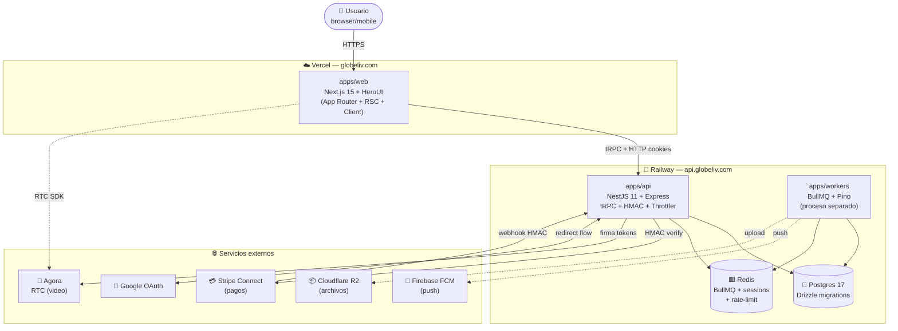
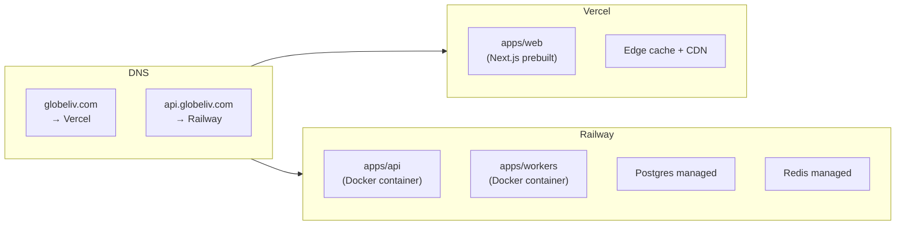

# Visión General del Sistema

> El diagrama maestro de GlobeLiv. **Léelo primero.** Todo lo demás en esta sección profundiza una pieza de aquí.

---

## 🧭 El sistema en 3 capas



---

## 🧱 Las 3 capas

### 1. Frontend — `apps/web` (Vercel)

- **Dominio:** `https://www.globeliv.com`
- **Tecnología:** Next.js 15 App Router + React 19 + HeroUI + Tailwind 4
- **Responsabilidad:** UI, routing, server components, comunicación tRPC con backend
- **Deploy:** prebuilt desde GitHub Actions → Vercel
- Detalle: [[Flujo Frontend (Next.js)]]

### 2. Backend — `apps/api` + `apps/workers` (Railway)

- **Dominio:** `https://api.globeliv.com`
- **Tecnología:** NestJS 11 sobre Express 4 + tRPC + Drizzle 0.38
- **Responsabilidad:** lógica de negocio, persistencia, autenticación, integración con servicios externos
- **Deploy:** Dockerfile multi-stage → Railway (auto-deploy desde `main`)
- Detalle: [[Flujo Backend (NestJS)]] + [[Flujo Workers (BullMQ)]]

### 3. Servicios externos

- **Agora** → RTC (el video NUNCA pasa por nuestros servers)
- **Cloudflare R2** → archivos (cuando se active billing)
- **Stripe Connect** → pagos (Sprint 4)
- **Firebase FCM** → push notifications (Sprint 6)
- **Google OAuth** → sign-in con Google (ya activo)

---

## 🗺 ¿Qué corre dónde?



Detalle completo en [[Topología de Despliegue]].

---

## 🔁 Caminos críticos de datos

### Path 1 — Auth (cookie cross-domain)

```
Browser → www.globeliv.com (Vercel) → tRPC call → api.globeliv.com (Railway)
                                                       ↓
                                                  Postgres
                                                       ↑
                                              Set-Cookie globeliv_access
                                                       ↓
                                              eTLD+1 = globeliv.com
                                                       ↓
                                              SameSite=lax funciona
```

Detalle: [[Flujo End-to-End — Auth]] + [[Seguridad y Auth]].

### Path 2 — Streaming (Agora RTC bypass)

```
Streamer browser ─── 1) crea stream ──► api.globeliv.com
                                              ↓
                                     INSERT streams
                                              ↓
                                     firma hostToken
                                              ↓
                Streamer browser ◄────── token ──┘

Streamer browser ════ 2) publish RTC ═════════════════► Agora cloud
                                                              ↑
Viewer browser ─── 3) joinAsViewer ──► api ───────► firma viewerToken
                                                              │
Viewer browser ════ 4) subscribe RTC ═════════════════════════╝
                                                  (Agora cloud relay)

  El video NUNCA toca api.globeliv.com.
```

Detalle: [[Flujo End-to-End — Streaming]].

### Path 3 — Trabajo asíncrono (workers + Redis)

```
api  ── trigger job ──► Redis (BullMQ)
                              │
                              ▼
                       apps/workers consume
                              │
                              ├──► Postgres (writes)
                              ├──► R2 (upload thumbnail)
                              └──► FCM (push)
```

Detalle: [[Flujo Workers (BullMQ)]].

---

## 🧠 Principios que dictan toda esta arquitectura

Los 7 fundamentales (vienen de `Globeliv/CLAUDE.md` §2):

1. **Escala antes que todo lo demás** — ¿aguanta 10x el tráfico sin rediseñar?
2. **Velocidad sobre perfección** — cada sprint cierra con algo desplegable
3. **Costo controlado** — prompt cache + Haiku/Sonnet según tarea
4. **Type-safety end-to-end** sin GraphQL — TS estricto + Zod + tRPC
5. **Observabilidad obligatoria** — Pino con PII redact, health checks
6. **Seguridad por default** — HMAC, JWT revocable, rate-limit, Zod
7. **Idempotencia en todo** — soft-deletes, ON CONFLICT, jobIds determinísticos

Las **decisiones concretas** que enforcean estos principios están en [[Decisiones de Arquitectura (ADRs)]].

---

## 🔗 Próximas paradas

- [[Stack y Versiones]] — qué versión exacta de cada cosa
- [[Topología de Despliegue]] — cómo está montado en producción
- [[Modelo de Datos]] — las tablas que existen hoy
